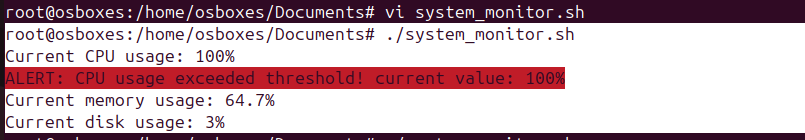

## SHELL SCRIPT FOR SYSTEM MONITORING
Introduction
In this project, you will create a Linux system monitor using a shell script. This script will continuously track the CPU, memory, and disk usage of your system, displaying the usage percentages in real time. If the usage of any resource exceeds a preset threshold, an alert will be displayed. By completing this project, you will learn foundational Linux scripting skills while building a practical tool.

Linux System Monitor
🎯 Tasks
By completing this project, you will:
Learn how to create a shell script to monitor system resources.
Understand how to set and use threshold values for CPU, memory, and disk usage.
Create a function to send alerts when thresholds are exceeded.
🏆 Achievements
After completing this project, you will:

Be able to create and run a Linux system monitor using a shell script.
Understand how to work with system resource commands like top, free, and df.
Be equipped to extend the script by adding new features, such as email notifications. 
🎯 When we ran this script it will display/notifies the resource utilization like CPU, Memory & Disk in percentages and also it will notifies you in red 
   when any resources threshoald breached.
   
   in this script we used commands like "TOP" for CPU
                                        "free" for Memory
                                        "df -h" for disk
                                        
    CPU Usage fetch --- top -bn1 | grep "Cpu(s)" | awk '{print $2 +$4}'
              * top -bn1 -- will fetch the CPU usage
              * grep "CPU(s)" - Pipe will pass the results to grep command and it will see values for CPU
              * awk '{print $2 +$4}' - awk will print the 2 & 4 fields values from grep command results
              
    Memeory Usage fetch --- free | awk '/Mem/ {printf("%3.1f", ($3/$2) * 100)}'
              * free - command will show the memory usage details
              * awk '/Mem/ {printf("%3.1f", ($3/$2) * 100)}' - awk will see the "mem" patteren/values from "free" command result and print the value of ($3/$2) * 100)
                  Note: $3 - 3rd field value form result 
                        $2 - 3nd field value form result

    Disk Usage fetch ---- df -h / | awk '/\// {print $(NF-1)}' 
              * df -h - command will fetch the disk usage details
              * awk '/\// {print $(NF-1)} - awk command will see for "/" pattern/values from "df -h" command result and print $(NF-1) will print the second-to-last field

OUTPUT: 
